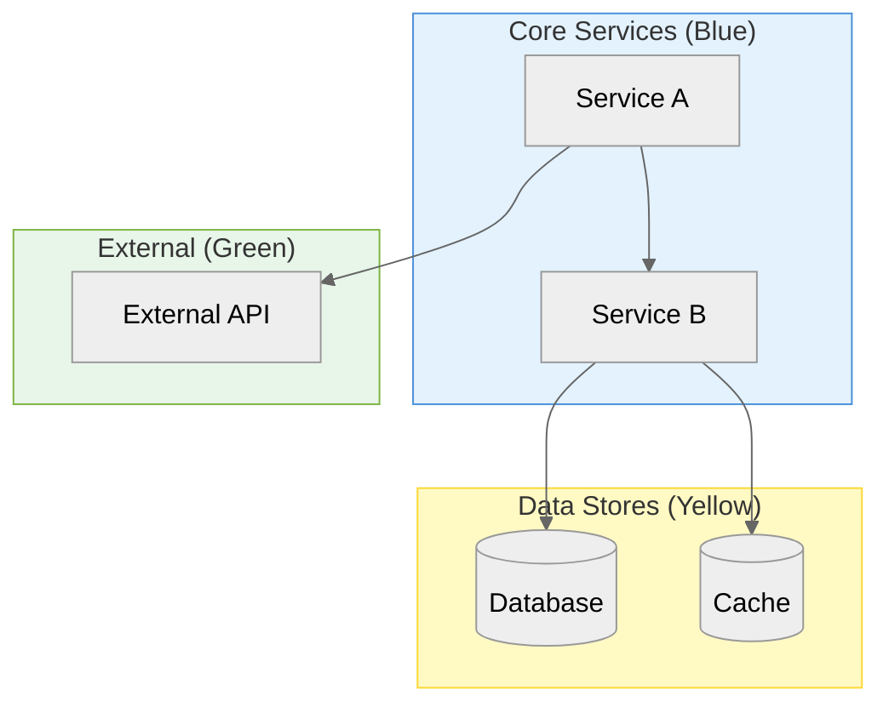
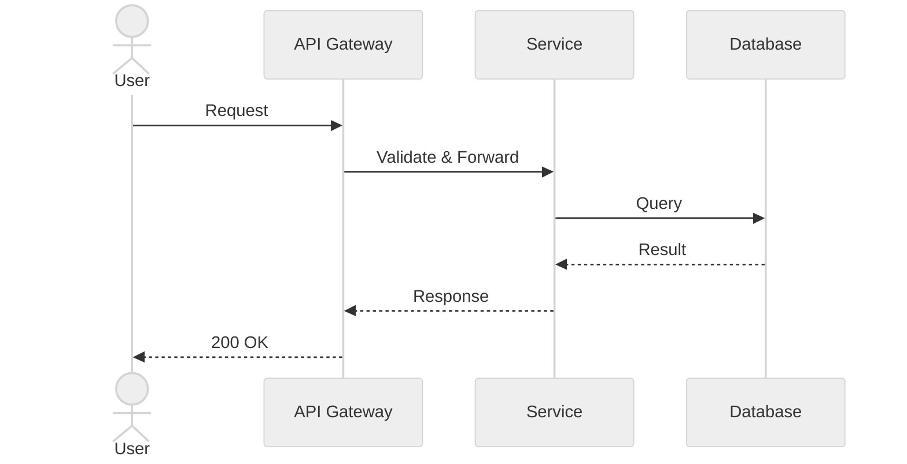
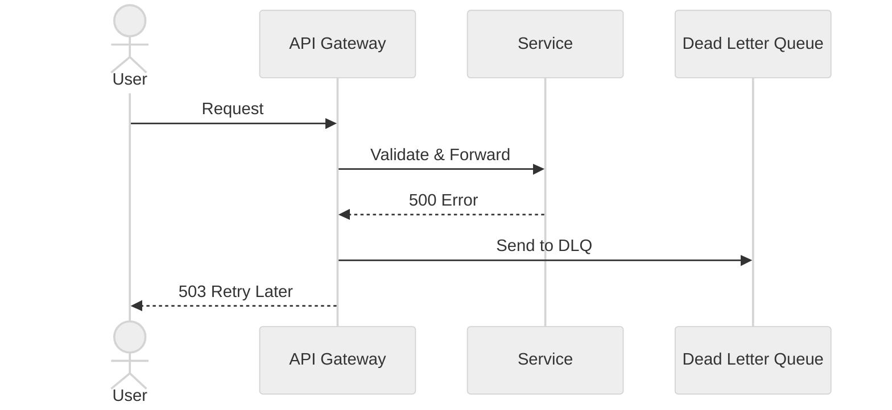
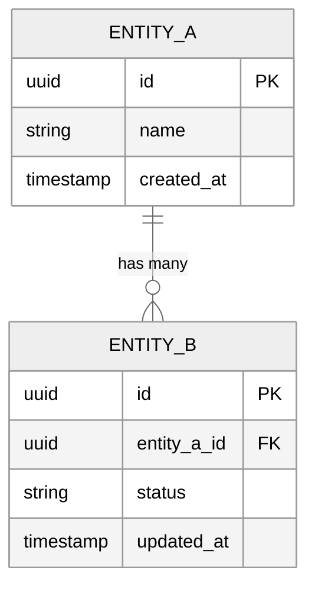
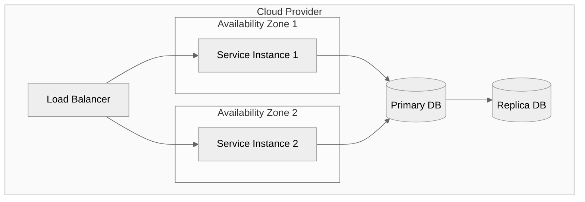

# High-Level Design: [System Name]

**Author:** [Name]
**Date:** [Date]
**Status:** Draft | In Review | Approved
**Version:** 1.0

---

## 1. Overview

### 1.1 Problem Statement
[What problem does this system solve?]

### 1.2 Goals
- [ ] [Goal 1]
- [ ] [Goal 2]
- [ ] [Goal 3]

### 1.3 Non-Goals
- [Explicitly out of scope]

### 1.4 Target Audience
[Who will use this system?]

---

## 2. System Context

<!-- diagram-tool: excalidraw -->
> **[Excalidraw hero diagram]** — Generate using Excalidraw MCP `create_view`.
> Show: system boundary, actors (users, admins, external systems), and all external dependencies.

---

## 3. Architecture

<!-- diagram-tool: mermaid -->

### 3.1 Component Responsibilities

| Component | Responsibility | Tech Stack |
|-----------|---------------|------------|
| [Name] | [What it does] | [Language/framework] |

### 3.2 Communication Patterns

| From | To | Protocol | Pattern |
|------|-----|----------|---------|
| [A] | [B] | REST/gRPC/Event | Sync/Async |

---

## 4. Design Decisions

| # | Decision | Options Considered | Chosen | Rationale | Trade-offs Accepted |
|---|----------|-------------------|--------|-----------|---------------------|
| 1 | [Decision] | A, B, C | B | [Why B] | [What's harder now] |
| 2 | [Decision] | X, Y | X | [Why X] | [What's given up] |

---

## 5. Data Flow

### 5.1 Happy Path

<!-- diagram-tool: mermaid -->

### 5.2 Error Path

<!-- diagram-tool: mermaid -->

---

## 6. Data Model

<!-- diagram-tool: mermaid -->

---

## 7. Non-Functional Requirements

| Category | Requirement | Target | Measurement |
|----------|------------|--------|-------------|
| Availability | Uptime | 99.9% | Monitoring dashboard |
| Latency | P99 response time | < 500ms | APM traces |
| Throughput | Requests per second | 1000 RPS | Load tests |
| Scalability | Horizontal scaling | Auto-scale 2–10 | Cloud metrics |
| Data Retention | Log retention | 90 days | Storage policy |

---

## 8. Infrastructure & Deployment

<!-- diagram-tool: mermaid -->

<!-- diagram-tool: python-diagrams -->
> **[Optional: Python Diagrams]** — If this uses AWS/GCP/Azure, generate a cloud architecture
> script in `examples/` showing the full deployment topology with provider icons.

---

## 9. Monitoring & Observability

### 9.1 Key Metrics

| Metric | Type | Alert Threshold |
|--------|------|-----------------|
| Request rate | Counter | > 5000 RPM |
| Error rate | Gauge | > 1% |
| P99 latency | Histogram | > 1s |
| CPU utilization | Gauge | > 80% |

### 9.2 Dashboards
- [Service overview dashboard]
- [Database performance dashboard]
- [Error tracking dashboard]

### 9.3 Log Aggregation
- Structured JSON logs → [ELK / CloudWatch / Datadog]
- Correlation ID propagation across services
- Log levels: ERROR for alerts, WARN for degradation, INFO for audit

---

## 10. Risks & Mitigations

| # | Risk | Probability | Impact | Mitigation | Owner |
|---|------|------------|--------|------------|-------|
| 1 | [Risk] | High/Med/Low | High/Med/Low | [Plan] | [Team] |
| 2 | [Risk] | High/Med/Low | High/Med/Low | [Plan] | [Team] |

---

## Appendix

### A. Glossary
| Term | Definition |
|------|-----------|
| [Term] | [Definition] |

### B. References
- [Link to related docs]
