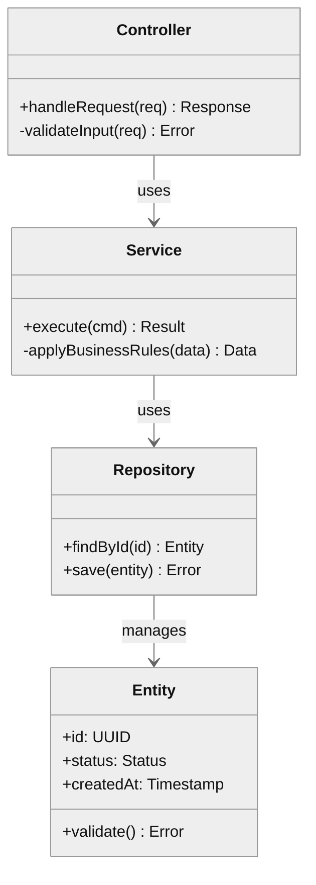
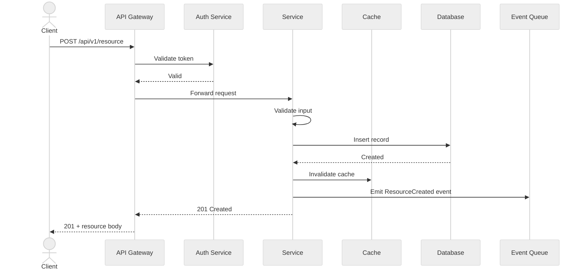
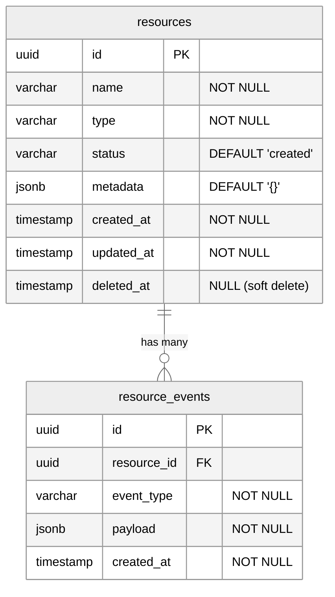
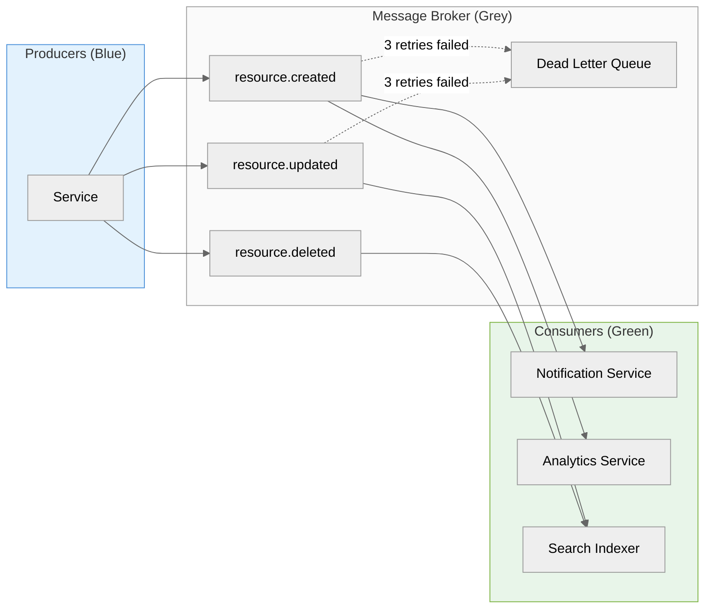
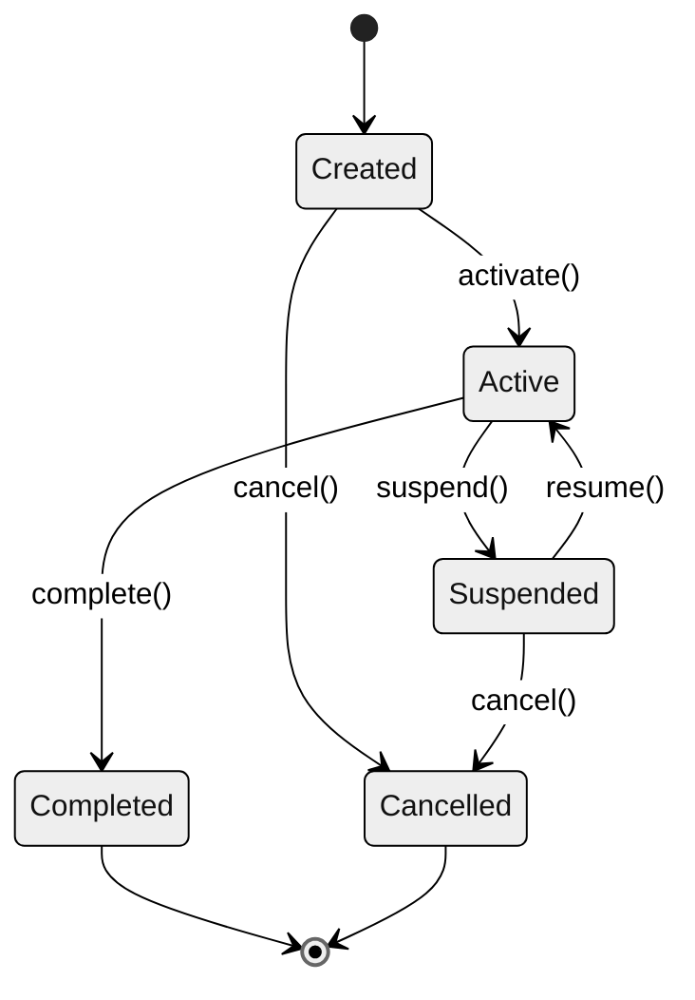

# Low-Level Design: [Module/Component Name]

**Author:** [Name]
**Date:** [Date]
**Status:** Draft | In Review | Approved
**Version:** 1.0
**Parent HLD:** [Link to HLD]

---

## 1. Overview

### 1.1 Module Purpose
[What this module does and why it exists]

### 1.2 Boundaries
- **Owns:** [What this module is responsible for]
- **Delegates:** [What it relies on other modules for]

### 1.3 Dependencies

| Dependency | Type | Purpose |
|-----------|------|---------|
| [Name] | Internal/External | [Why needed] |

### 1.4 Tech Stack

| Layer | Technology | Version |
|-------|-----------|---------|
| Language | [e.g., Go 1.22] | |
| Framework | [e.g., Gin] | |
| Database | [e.g., PostgreSQL 16] | |
| Cache | [e.g., Redis 7] | |

---

## 2. Module Architecture

<!-- diagram-tool: excalidraw -->
> **[Excalidraw hero diagram]** — Generate using Excalidraw MCP `create_view`.
> Show: internal layers (API → Service → Repository), interfaces between layers,
> and connections to external systems.

---

## 3. Class/Module Design

<!-- diagram-tool: mermaid -->


### 3.1 Design Patterns Used

| Pattern | Where | Why |
|---------|-------|-----|
| [e.g., Repository] | Data access | Decouple business logic from DB |
| [e.g., Strategy] | [Where] | [Why] |

---

## 4. API Design

### 4.1 Endpoints

| Method | Path | Description | Auth |
|--------|------|-------------|------|
| POST | /api/v1/resource | Create resource | Bearer |
| GET | /api/v1/resource/:id | Get resource | Bearer |
| PUT | /api/v1/resource/:id | Update resource | Bearer |
| DELETE | /api/v1/resource/:id | Delete resource | Bearer |
| GET | /api/v1/resources | List resources | Bearer |

### 4.2 Request/Response Schemas

**POST /api/v1/resource**

Request:
```json
{
  "name": "string (required, 1-255 chars)",
  "type": "enum: [typeA, typeB, typeC]",
  "metadata": {
    "key": "string"
  }
}
```

Response (201):
```json
{
  "id": "uuid",
  "name": "string",
  "type": "string",
  "status": "created",
  "metadata": {},
  "createdAt": "ISO-8601",
  "updatedAt": "ISO-8601"
}
```

### 4.3 Error Codes

| Code | Message | HTTP Status | Retryable |
|------|---------|-------------|-----------|
| RESOURCE_NOT_FOUND | Resource not found | 404 | No |
| VALIDATION_ERROR | Invalid input | 400 | No (fix input) |
| CONFLICT | Resource already exists | 409 | No |
| RATE_LIMITED | Too many requests | 429 | Yes (after backoff) |
| INTERNAL_ERROR | Internal server error | 500 | Yes |
| SERVICE_UNAVAILABLE | Upstream unavailable | 503 | Yes |

### 4.4 Rate Limiting

| Endpoint | Limit | Window | Burst |
|----------|-------|--------|-------|
| POST | 100 | 1 min | 20 |
| GET | 500 | 1 min | 50 |
| LIST | 60 | 1 min | 10 |

### 4.5 Pagination

```
GET /api/v1/resources?cursor=<token>&limit=20

Response:
{
  "data": [...],
  "pagination": {
    "nextCursor": "token_or_null",
    "hasMore": true,
    "totalCount": 142
  }
}
```

---

## 5. API Flow

<!-- diagram-tool: mermaid -->


---

## 6. Database Design

### 6.1 Schema

<!-- diagram-tool: mermaid -->


### 6.2 Index Strategy

| Table | Index Name | Columns | Type | Purpose |
|-------|-----------|---------|------|---------|
| resources | idx_resources_status | status, created_at | B-tree | Filter by status + sort |
| resources | idx_resources_type | type | B-tree | Filter by type |
| resources | idx_resources_name_gin | name | GIN (trigram) | Full-text search |
| resource_events | idx_events_resource | resource_id, created_at | B-tree | Event lookup |

### 6.3 Migration Strategy
- Use versioned migrations (e.g., golang-migrate, Flyway, Alembic)
- All migrations must be reversible
- Test migrations on a copy of production data before deploying

---

## 7. Event Design

<!-- diagram-tool: mermaid -->


### 7.1 Event Schema
```json
{
  "id": "uuid",
  "type": "resource.created",
  "source": "service-name",
  "timestamp": "ISO-8601",
  "data": {
    "resourceId": "uuid",
    "changes": {}
  },
  "metadata": {
    "correlationId": "uuid",
    "version": 1
  }
}
```

---

## 8. State Machine

<!-- diagram-tool: mermaid -->


### 8.1 Transition Rules

| From | To | Trigger | Guard Condition |
|------|----|---------|-----------------|
| Created | Active | activate() | All required fields set |
| Active | Suspended | suspend() | Admin only |
| Suspended | Active | resume() | Suspension reason resolved |

---

## 9. Error Handling

### 9.1 Error Taxonomy

| Category | Example | Action |
|----------|---------|--------|
| Validation | Missing field | Return 400 immediately |
| Business | Duplicate name | Return 409 immediately |
| Transient | DB timeout | Retry with backoff |
| Fatal | Schema mismatch | Alert + fail fast |

### 9.2 Retry Strategy

```yaml
retry:
  maxAttempts: 3
  initialDelay: 100ms
  maxDelay: 5s
  multiplier: 2.0
  retryableErrors:
    - DEADLINE_EXCEEDED
    - UNAVAILABLE
    - RESOURCE_EXHAUSTED
```

### 9.3 Circuit Breaker

```yaml
circuitBreaker:
  failureThreshold: 5        # trips after 5 failures
  successThreshold: 3         # resets after 3 successes
  timeout: 30s                # half-open after 30s
  monitoredExceptions:
    - TimeoutException
    - ConnectionRefused
```

### 9.4 Fallback Behavior
| Scenario | Fallback |
|----------|----------|
| Cache miss | Read from DB |
| Primary DB down | Read from replica (stale read) |
| Event queue down | Write to outbox table, process later |

---

## 10. Configuration

```yaml
# config.yaml — defaults
server:
  host: 0.0.0.0
  port: 8080
  readTimeout: 30s
  writeTimeout: 30s

database:
  host: localhost
  port: 5432
  name: mydb
  maxConnections: 25
  idleConnections: 5
  connMaxLifetime: 5m

cache:
  host: localhost
  port: 6379
  ttl: 5m
  maxRetries: 3

features:
  enableNewFlow: false
  enableBetaAPI: false

# Environment overrides (via env vars):
# SERVER_PORT=9090
# DATABASE_HOST=prod-db.internal
# FEATURES_ENABLE_NEW_FLOW=true
```

---

## 11. Testing Strategy

### 11.1 Test Pyramid

| Level | Count Target | What to Test |
|-------|-------------|-------------|
| Unit | ~80% | Business logic, validation, transformations |
| Integration | ~15% | DB queries, cache ops, API contracts |
| E2E | ~5% | Critical user journeys |

### 11.2 Key Test Scenarios

| Scenario | Type | Priority |
|----------|------|----------|
| Create resource — happy path | Integration | P0 |
| Create resource — duplicate name | Unit | P0 |
| State transition — invalid | Unit | P1 |
| API auth — expired token | Integration | P1 |
| Concurrent updates — optimistic lock | Integration | P1 |

### 11.3 Mocking Strategy
- External APIs: use interface stubs / HTTP record-replay
- Database: use testcontainers for integration, in-memory for unit
- Events: use in-memory broker for integration tests

---

## 12. Security

### 12.1 Authentication & Authorization
- Auth method: [JWT / OAuth2 / API Key]
- Token validation: [At gateway / per-service]
- RBAC roles: Admin, Editor, Viewer

### 12.2 Input Validation Rules

| Field | Rule |
|-------|------|
| name | 1-255 chars, alphanumeric + hyphens |
| type | Enum whitelist |
| metadata keys | Max 50 keys, key length ≤ 64 |

### 12.3 Encryption
- **At rest:** AES-256 for PII columns, KMS-managed keys
- **In transit:** TLS 1.3 for all service-to-service communication
- **Secrets:** Vault / AWS Secrets Manager — never in config files

### 12.4 OWASP Checklist

| Item | Status |
|------|--------|
| SQL injection prevention (parameterized queries) | ☐ |
| XSS prevention (output encoding) | ☐ |
| CSRF protection | ☐ |
| Rate limiting | ☐ |
| Security headers (CSP, HSTS, etc.) | ☐ |
| Dependency vulnerability scanning | ☐ |

---

## Appendix

### A. Glossary
| Term | Definition |
|------|-----------|
| [Term] | [Definition] |

### B. References
- [Link to HLD]
- [Link to API docs]
