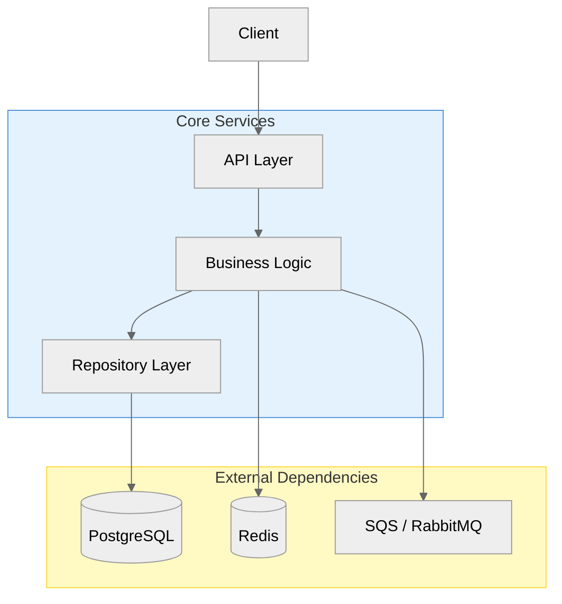
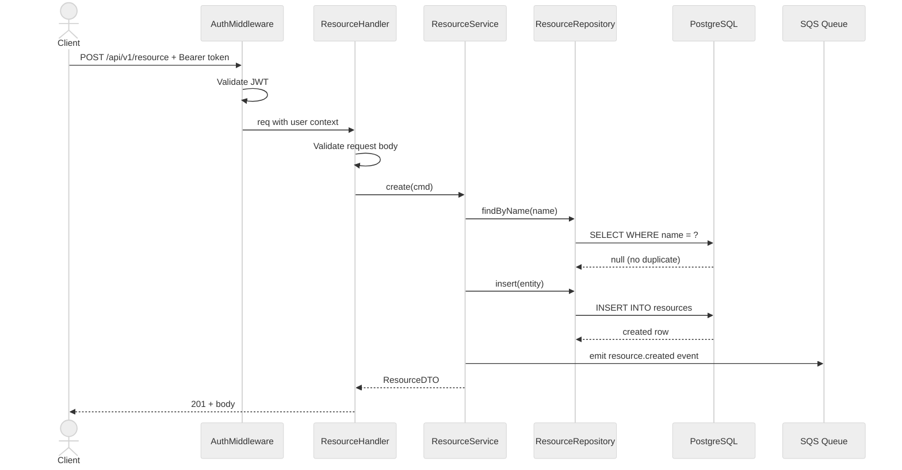

# Onboarding Guide: [System Name]

**Written by:** [Principal Architect Name]
**Last updated:** [Date]
**Codebase:** [repo URL]
**Related docs:** [HLD](./hld-<system>.md) · [LLD](./lld-<module>.md)

> **Note to the reader:** This document is exhaustive by design. A new engineer should be able to understand, run, and contribute to this system using only this document. If something is unclear or missing, that's a bug — open a PR.

---

## Table of Contents

1. [What Is This System?](#1-what-is-this-system)
2. [Repo Structure](#2-repo-structure)
3. [Architecture Overview](#3-architecture-overview)
4. [Key Files Every Developer Must Know](#4-key-files-every-developer-must-know)
5. [Core Abstractions & Design Patterns](#5-core-abstractions--design-patterns)
6. [Data Model](#6-data-model)
7. [API Reference](#7-api-reference)
8. [Key Data Flow Walkthroughs](#8-key-data-flow-walkthroughs)
9. [Local Development Setup](#9-local-development-setup)
10. [Daily Developer Workflows](#10-daily-developer-workflows)
11. [Configuration & Environment Variables](#11-configuration--environment-variables)
12. [Testing Guide](#12-testing-guide)
13. [Coding Conventions](#13-coding-conventions)
14. [Deployment & Operations](#14-deployment--operations)
15. [Design Decisions](#15-design-decisions)
16. [Gotchas & FAQs](#16-gotchas--faqs)
17. [First Week Checklist](#17-first-week-checklist)

---

## 1. What Is This System?

[One paragraph: what it does, who uses it, what problem it solves.]

### Domain Glossary

| Term | Definition | Where it appears in code |
|------|-----------|--------------------------|
| [Term] | [Plain-English definition] | `src/domain/[file].ts` |
| [Term] | [Plain-English definition] | `models/[file].go` |

---

## 2. Repo Structure

```
[system-name]/
├── src/                    # [what's in here]
│   ├── api/                # [HTTP handlers / controllers]
│   ├── services/           # [business logic]
│   ├── models/             # [data models / entities]
│   └── workers/            # [background jobs]
├── migrations/             # [database migrations — run in order]
├── tests/                  # [test suite]
├── docs/                   # [design docs and diagrams]
├── config/                 # [environment configs]
├── Makefile                # [common dev commands — start here]
└── docker-compose.yaml     # [local infrastructure]
```

### Start Here
Before reading anything else, read these files in this order:
1. `[entry-point file]` — boots the application
2. `[router/handler registration file]` — shows all API surfaces
3. `[core domain model]` — the central data structure everything revolves around
4. `[config loader]` — shows all required environment variables

---

## 3. Architecture Overview

<!-- diagram-tool: excalidraw -->
> **[Excalidraw hero diagram]** — Full system overview: all components, external services, and data flows.

<!-- diagram-tool: mermaid -->


### Component Responsibilities

| Component | What it does | Key files |
|-----------|-------------|-----------|
| API Layer | HTTP routing, request validation, auth middleware | `src/api/` |
| Business Logic | Domain rules, orchestration | `src/services/` |
| Repository | All DB queries, no business logic | `src/repo/` |

---

## 4. Key Files Every Developer Must Know

| File | What it does | When you'll change it |
|------|-------------|----------------------|
| `[entry point]` | Boots the app, wires dependencies | Almost never |
| `[router file]` | Registers all routes | When adding an endpoint |
| `[middleware file]` | Auth, logging, error handling | When changing cross-cutting behavior |
| `[core model]` | Central domain entity | When schema changes |
| `[config file]` | Loads and validates all env vars | When adding a new config |
| `[migration dir]` | DB schema history | When changing schema |

### Entry Point

```[language]
// [entry-point file] — line [N]
// [short explanation of what the bootstrap does]
[actual code snippet from the repo]
```

---

## 5. Core Abstractions & Design Patterns

### [Abstraction 1 — e.g., Repository Interface]

**What it is:** [explanation]
**Why it exists:** [reason — e.g., decouples business logic from DB driver]

```[language]
// [file path:line]
[interface/abstract class definition from the codebase]
```

**How to implement it:**
```[language]
// [example implementation file:line]
[concrete implementation snippet]
```

**All existing implementations:** `[list files]`

---

### [Abstraction 2 — e.g., Service base / Middleware pattern]

[repeat structure above]

---

## 6. Data Model

<!-- diagram-tool: mermaid -->
```mermaid
%%{init: {'theme': 'neutral'}}%%
erDiagram
    [ENTITY_A] {
        uuid id PK
        varchar name "NOT NULL"
        varchar status "DEFAULT 'active'"
        timestamp created_at "NOT NULL"
        timestamp updated_at "NOT NULL"
    }
    [ENTITY_B] {
        uuid id PK
        uuid entity_a_id FK
        jsonb metadata
        timestamp deleted_at "soft delete"
    }
    [ENTITY_A] ||--o{ [ENTITY_B] : "has many"
```

### Entity Descriptions

**[ENTITY_A]** — [What this represents in the domain. When it's created. What its lifecycle looks like.]
- `status` — can be: `active`, `suspended`, `deleted`. Transitions are enforced in `src/services/[file]`
- `metadata` — free-form JSON, keys defined in `src/types/metadata.ts`

---

## 7. API Reference

Base URL: `https://[domain]/api/v[N]`
Auth: [Bearer JWT / API Key / OAuth2] — header: `Authorization: Bearer <token>`

| Method | Path | Description | Auth required |
|--------|------|-------------|---------------|
| POST | `/resource` | Create resource | Yes |
| GET | `/resource/:id` | Get by ID | Yes |
| PUT | `/resource/:id` | Update | Yes |
| DELETE | `/resource/:id` | Soft delete | Admin only |
| GET | `/resources` | List (paginated) | Yes |

### POST /resource

**Handler:** `src/api/handlers/[file]:[line]`

Request:
```json
{
  "name": "string, required, max 255 chars",
  "type": "enum: typeA | typeB",
  "metadata": { "optional": "object" }
}
```

Response `201`:
```json
{
  "id": "uuid",
  "name": "string",
  "status": "active",
  "createdAt": "2025-01-01T00:00:00Z"
}
```

Error responses:
```json
{ "code": "VALIDATION_ERROR", "message": "name is required", "status": 400 }
{ "code": "CONFLICT", "message": "name already exists", "status": 409 }
```

---

## 8. Key Data Flow Walkthroughs

### Flow 1: [Most important operation — e.g., "User creates a resource"]

**What happens, step by step:**

1. Client sends `POST /api/v1/resource` with bearer token
2. `AuthMiddleware` (`src/middleware/auth.ts:45`) validates the JWT, attaches user to request context
3. `ResourceHandler.create` (`src/api/handlers/resource.ts:23`) validates the request body
4. Calls `ResourceService.create` (`src/services/resource.ts:67`)
5. Service checks for duplicate name via `ResourceRepository.findByName` (`src/repo/resource.ts:34`)
6. Inserts into DB, emits `resource.created` event to SQS queue
7. Returns the created entity

<!-- diagram-tool: mermaid -->


**What happens when it fails:**
- JWT expired → 401, no DB call made
- Duplicate name → 409, DB rolled back
- DB down → 503, event not emitted (outbox pattern handles retry)

---

## 9. Local Development Setup

### Prerequisites

| Tool | Version | Check | Install |
|------|---------|-------|---------|
| [Language runtime] | [exact version] | `[cmd] --version` | [how] |
| Docker | 24+ | `docker --version` | docker.com |
| [DB cli] | [version] | `[cmd] --version` | `brew install [pkg]` |
| [Other tool] | [version] | | |

### Step-by-Step Setup

```bash
# 1. Clone
git clone [repo-url]
cd [repo-name]

# 2. Install dependencies
[npm install / go mod download / pip install -r requirements.txt]

# 3. Start infrastructure
docker-compose up -d

# 4. Create .env from template
cp .env.example .env
# Edit .env — all required vars are listed in Section 11

# 5. Run database migrations
[migration command]

# 6. Seed development data (optional but recommended)
[seed command]

# 7. Start the app
[start command]
```

### Verify It's Working

```bash
[health check command or curl]
# Expected output:
# {"status": "ok", "version": "1.0.0"}
```

---

## 10. Daily Developer Workflows

### Run Tests
```bash
# All tests
[test command]

# Single file
[test command] [path/to/test]

# Tests matching a pattern
[test command] --grep "[pattern]"

# With coverage
[test command] --coverage
```

### Add a New API Endpoint

1. Add route in `[router file]`
2. Create handler in `src/api/handlers/[resource].ts` — follow the pattern in existing handlers
3. Add service method in `src/services/[resource].ts`
4. Add repository method in `src/repo/[resource].ts` if DB access needed
5. Add request validation schema in `src/schemas/`
6. Write integration test in `tests/api/[resource].test.ts`

### Add a Database Migration

```bash
# Create migration file
[migration create command] --name [migration-name]
# Creates: migrations/[timestamp]_[migration-name].[up/down].sql

# Edit the generated file, then run:
[migration run command]

# Verify:
[migration status command]
```

### Add a Background Job

[Steps specific to the job framework used]

### Debug Locally

```bash
# Start in debug mode
[debug command]
```
Then attach your debugger to port `[N]`. In VS Code, use the config in `.vscode/launch.json`.

### Lint & Format

```bash
[lint command]        # check
[lint fix command]    # auto-fix
[format command]      # format
```

---

## 11. Configuration & Environment Variables

Config is loaded by `[config file]`. All vars are validated at startup — the app will refuse to start if a required var is missing.

### Application

| Variable | Required | Default | Description |
|----------|----------|---------|-------------|
| `PORT` | No | `8080` | HTTP server port |
| `LOG_LEVEL` | No | `info` | `debug`, `info`, `warn`, `error` |
| `NODE_ENV` | Yes | — | `development`, `staging`, `production` |

### Database

| Variable | Required | Default | Description |
|----------|----------|---------|-------------|
| `DATABASE_URL` | Yes | — | Full PostgreSQL connection string |
| `DB_POOL_SIZE` | No | `25` | Max connections |

### External Services

| Variable | Required | Default | Description |
|----------|----------|---------|-------------|
| `[SERVICE]_API_KEY` | Yes | — | [What it's used for] |
| `[SERVICE]_URL` | Yes | — | Base URL |

### Feature Flags

| Variable | Required | Default | Description |
|----------|----------|---------|-------------|
| `ENABLE_[FEATURE]` | No | `false` | [What it enables] |

---

## 12. Testing Guide

### Structure

```
tests/
├── unit/           # Pure function tests, no I/O
├── integration/    # Tests with real DB (testcontainers)
└── e2e/            # Full HTTP tests against running app
```

### Running Each Layer

```bash
[unit test command]
[integration test command]
[e2e test command]
```

### Writing a Unit Test

```[language]
// Follow this pattern (from tests/unit/[example].test.ts):
[real test example from the codebase showing describe/it/expect pattern]
```

### Writing an Integration Test

```[language]
// Follow this pattern (from tests/integration/[example].test.ts):
[real test example showing DB setup/teardown and test structure]
```

### Mocking

- External HTTP APIs: [how mocks are set up — e.g., msw, nock, httptest]
- Database: [testcontainers / in-memory / test DB]
- Time: [how time is mocked if applicable]

---

## 13. Coding Conventions

### File Organization
- One concept per file. File name = the main export name.
- [Other conventions specific to this codebase]

### Error Handling Pattern
```[language]
// The pattern used in this codebase (from src/[file]):
[real error handling snippet]
```
**Do not** swallow errors or return `null` on failure — always propagate with context.

### Logging Pattern
```[language]
// Use the logger from src/utils/logger.ts — never use console.log in production code
[real logging snippet]
```

### What NOT To Do
- **Don't put business logic in handlers** — handlers validate input, call a service, return a response. That's it.
- **Don't query the DB from service files directly** — always go through the repository layer.
- **Don't catch errors unless you can handle them** — let them bubble to the global error handler.
- [Other anti-patterns specific to this codebase]

---

## 14. Deployment & Operations

### CI/CD Pipeline

Triggered by: [push to main / PR merge / tag]

| Stage | What it does | Approx time |
|-------|-------------|-------------|
| Test | Runs full test suite | ~3 min |
| Build | Builds Docker image | ~2 min |
| Deploy (staging) | Auto-deploys on merge to main | ~5 min |
| Deploy (prod) | Manual approval required | ~5 min |

### Environments

| Env | URL | DB | How to access |
|-----|-----|-----|---------------|
| Local | localhost:[port] | Docker | `docker-compose up` |
| Staging | [url] | [DB identifier] | [access method] |
| Production | [url] | [DB identifier] | [access method] |

### How to Deploy to Production

[Exact steps — e.g., merge to main, trigger workflow, approve in UI]

### How to Roll Back

```bash
[rollback command or UI steps]
```

### Health Checks & Dashboards

- Health endpoint: `GET /health` — returns `{"status":"ok"}`
- Metrics dashboard: [URL]
- Logs: [how to query — e.g., CloudWatch query, Datadog search string]
- Error tracking: [Sentry/Datadog URL]

### Runbooks

**High error rate:**
1. Check error tracking for the error type
2. Check recent deploys in CI/CD
3. If deploy-related, roll back immediately
4. If data-related, check `[specific query/dashboard]`

**DB slow / high latency:**
1. Check `[slow query dashboard]`
2. Common culprits: missing index, lock contention, N+1 from `[typical location]`

---

## 15. Design Decisions

| # | Decision | Why this approach | Trade-offs accepted |
|---|----------|------------------|---------------------|
| 1 | [e.g., Cursor-based pagination] | [reason] | [trade-offs] |
| 2 | [e.g., Outbox pattern for events] | [reason] | [trade-offs] |
| 3 | [e.g., Repository pattern] | [reason] | [trade-offs] |

*For full ADR history, see [HLD document](./hld-[system].md#4-design-decisions).*

---

## 16. Gotchas & FAQs

**Q: Why does [confusing behavior] happen?**
A: [Explanation + pointer to the code that causes it, file:line]

**Q: Why is there a [strange pattern] in [file]?**
A: [Historical reason or intentional trade-off]

**Q: I added a field to the model but the API isn't returning it — why?**
A: [e.g., The DTO serializer in `src/api/serializers/` is explicit — add the field there too. `file:line`]

**Q: My test is passing locally but failing in CI — why?**
A: [e.g., Tests run in parallel in CI. If you're relying on insertion order, use explicit ordering. See `tests/helpers/db.ts:34` for the test DB setup.]

**Q: What's the difference between `[thing A]` and `[thing B]`?**
A: [explanation]

**Q: Why does the app take so long to start locally?**
A: [e.g., It runs all pending migrations on startup. Check `src/bootstrap.ts:89`]

**Q: How do I reset my local database?**
```bash
[exact command]
```

**Q: I'm getting a [specific error] — what does it mean?**
A: [explanation + fix]

---

## 17. First Week Checklist

### Day 1 — Get oriented
- [ ] Run local setup (Section 9) — app starts and health check passes
- [ ] Read the codebase map (Section 2) — understand the directory structure
- [ ] Read the architecture overview (Section 3)
- [ ] Read the 4 "start here" files listed in Section 2

### Day 2 — Run and explore
- [ ] Run the full test suite — all tests pass
- [ ] Read the daily workflows (Section 10) — understand all the commands
- [ ] Step through one data flow walkthrough (Section 8) in your debugger
- [ ] Make a trivial change (add a log line, fix a typo) and open a PR

### Day 3 — Contribute
- [ ] Implement a small feature end-to-end: new endpoint → service → repository → test
- [ ] Read the coding conventions (Section 13)
- [ ] Read all the gotchas (Section 16)

### Contacts
| Area | Owner | How to reach |
|------|-------|-------------|
| Backend / API | [Name] | [Slack/email] |
| Database / Data model | [Name] | [Slack/email] |
| Infrastructure / DevOps | [Name] | [Slack/email] |
| Product / Domain questions | [Name] | [Slack/email] |
